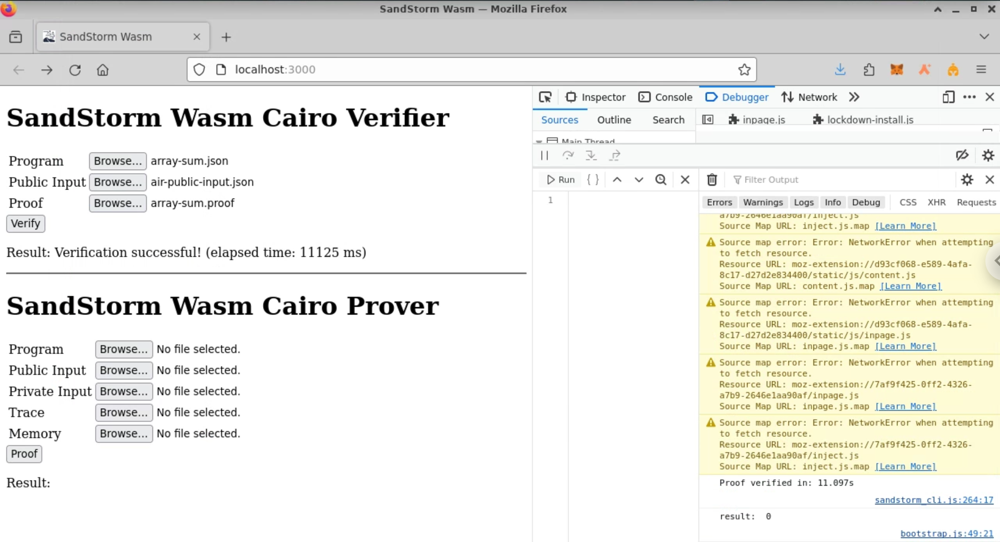
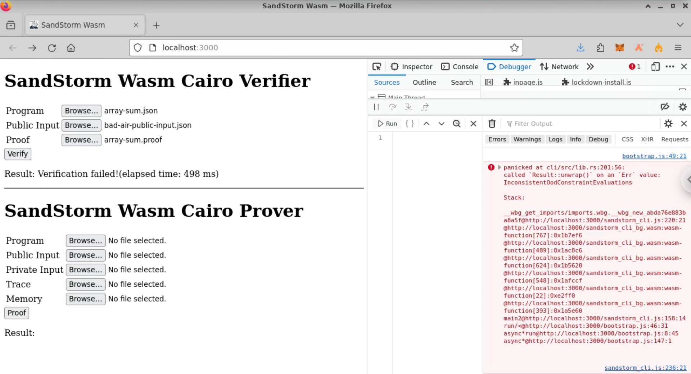
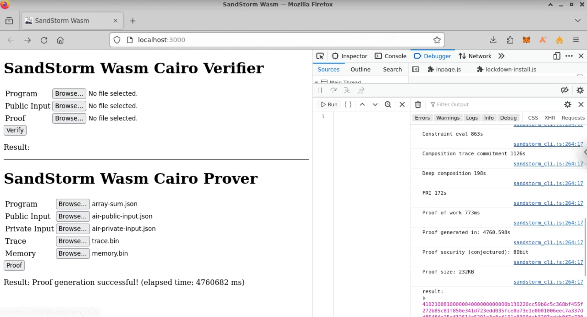

# Wasm sandstorm

**Cairo prover powered by [miniSTARK](https://github.com/andrewmilson/ministark/)**

> **Warning**
> this code is new and will change in future versions. Please try it out and provide feedback.

Sandstorm is a Cairo prover built by Andrew Milson on top of miniSTARK. The prover was built by reverse engineering [StarkWare's open source verifier](https://github.com/starkware-libs/starkex-contracts) and was used to submit the first independent proof to StarkWare's Ethereum verifier (see tweet [here](https://twitter.com/andrewmilson/status/1686292241990692864)).

You can find Sandstorm on [Andrew Milson repository](https://github.com/andrewmilson/ministark/).

This is just a slightly modified version to learn Wasm and demonstrate that we can run Sandstorm in a web browser with Wasm. There is a lot of wasm optimization to be done to achieve real Sandstorm speed.

This release uses a slightly [modified](https://github.com/devnet0x/ministark) version of Ministark to support WASM.

As an example, running in Firefox on a virtualized machine with 6 AMD EPYC 7282 16-core processors and 16 MB RAM, we get 10 seconds for verification and almost 1.2 hours for a proof.

## How to install locally

1) Download all files from [cli/pkg](https://github.com/devnet0x/sandstorm/tree/main/cli/pkg) folder.
2) Install a local http server like lite-server from npm.
3) Copy all your memory, trace and input files in the same folder.
4) Load in your browser.

## Notes
1) When generating the proof the browser will store automatically the .proof file in your Download folder.

## Screenshots
Verification Ok

Verificaton failed

Proof generation

